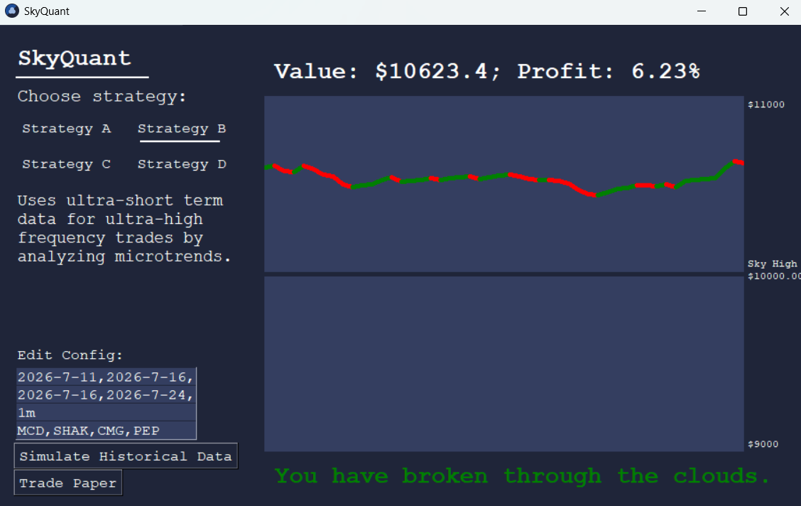
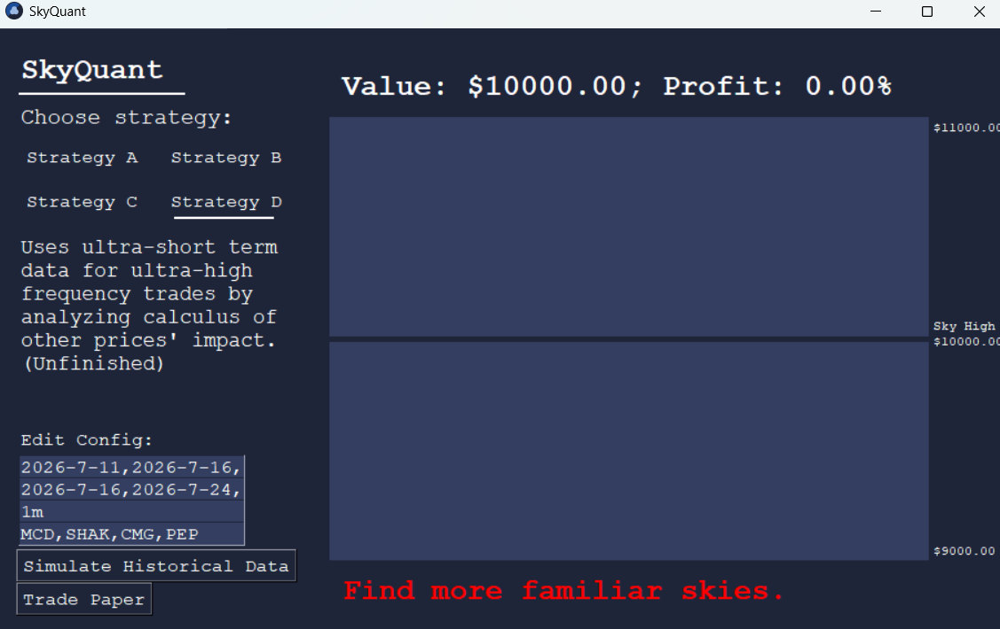

# SkyQuant
---
This is my solo project for Polaris. I wanted to make something practical, and had been needing to larp as a quant, so I decided a project like this would be perfect.
My prompt was "The next breakthrough waits beyond familiar skies." A predictive algorithm like this directly tries to find patterns its seen before - familiar skies. It then attempts to raise the value mountian to break through the clouds.
This is an amateur quant finance tool, or a set of algorithms designed to predict the stock market to turn a profit.
At the moment it can only simulate trading from historical reccords as Alpaca API has not been set up for live trading, but doing so would not take long.
Every part of it is written in python for ease of generalized math and numbers. No AI was used.
I did not finish everything I wanted to during Polaris (e.g. there were two more strategies I wanted to develop, I wanted to connect the software to Alpaca API for live paper trading, etc.), but the amount completed during the event is satisfactory for a demo.

Each strategy is different - strat A analyzes industry trends while strat B automated purchase influxes. Strat C is meant to use machine learning and strat D the partial derivitive.
Each strategy also has different strengths and weaknesses. Note this when choosing strategies for different markets.
Configuration is done with yahoo finance library rules. First line is start dates comma seperated, second line is corresponding end dates comma seperated (allows multiple time intervals when simulating historical data as historical data can only be taken in chunks, e.g. 8 days at a time for 1m frequency), third line is the time step frequency, and the fourth line is the stocks to trade comma seperated.
Overall I enjoyed getting to develop these algorithms and almost beating the S&P at times with strat B.
